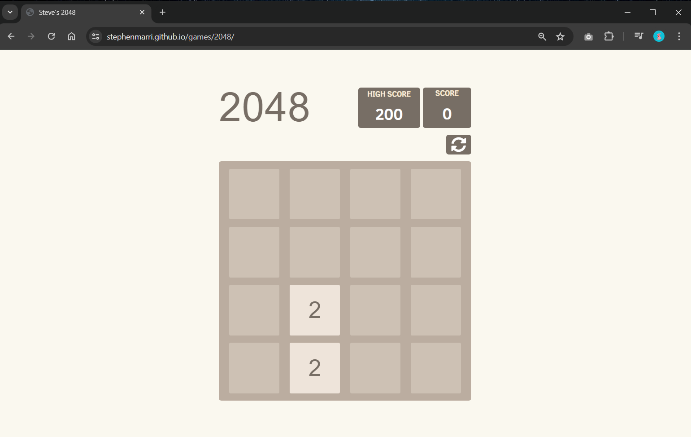

### Hi there 👋

<!--
**stephenmarri/stephenmarri** is a ✨ _special_ ✨ repository because its `README.md` (this file) appears on your GitHub profile.

Here are some ideas to get you started:

- 🔭 I’m currently working on ...
- 🌱 I’m currently learning ...
- 👯 I’m looking to collaborate on ...
- 🤔 I’m looking for help with ...
- 💬 Ask me about ...
- 📫 How to reach me: ...
- 😄 Pronouns: ...
- ⚡ Fun fact: ...
-->

This is Stephen. Check out all the games and projects that I've built. Drop a note if you have some interesting ideas for me.
Check out my GitHub repos by clicking [here](https://github.com/stephenmarri).

## Vanilla JS - games  
These games are inspired from popular ideas and are almost similar to their original form.  
  
  1. Sudoku         - [Click here to play the game](https://stephenmarri.github.io/games/sudoku/)
  2. 2048           - [Click here to play the game](https://stephenmarri.github.io/games/2048/)
  3. Tetris         - [Click here to play the game](https://stephenmarri.github.io/games/tetris/)  
  4. BreakOut       - [Click here to play the game](https://stephenmarri.github.io/games/breakout/)  
  5. Space Invaders - [Click here to play the game](https://stephenmarri.github.io/games/spaceInvaders/)
  6. Nokia Snake    - [Click here to play the game](https://stephenmarri.github.io/games/nokiasnake/)  
  7. Memory Cards   - [Click here to play the game](https://stephenmarri.github.io/games/memoryCards/)  
  8. Connect Four   - [Click here to play the game](https://stephenmarri.github.io/games/connectfour/)  
  9. Whackamole     - [Click here to play the game](https://stephenmarri.github.io/games/whackamole/)  
  10. Frogger        - [Click here to play the game](https://stephenmarri.github.io/games/frogger/)

| __SUDOKU__  _[Click here to play the game](https://stephenmarri.github.io/games/sudoku/)_        | Sudoku         - [Click here to play the game](https://stephenmarri.github.io/games/sudoku/)     |
| ------------- | ------------- |
| Sudoku         - [Click here to play the game](https://stephenmarri.github.io/games/sudoku/)     | Sudoku         - [Click here to play the game](https://stephenmarri.github.io/games/sudoku/)     |

<em>Except 'Frogger' and 'Space Invaders' all the remaining are compatible with mobile devices.</em>

## JavaScript Projects

The below are a few fully functional JavaScript projects which are inspired from some popular ideas.

 1. [Sorting Visualizer](https://stephenmarri.github.io/js_projects/sortingVisualizer/)
 2. [Cipher's](https://stephenmarri.github.io/js_projects/ciphers/)
 3. [Mathematical Functions](https://stephenmarri.github.io/js_projects/mathFunctions/)
 4. [Project Euler Solutions](https://stephenmarri.github.io/project_euler/site/)

## JavaScript30

Contains my versions of the projects that are a part of Wes Bos's 30 days of Vanilla JS.
  
Below are the github pages links where you can access each project.    
  
1. [Drum Kit](https://stephenmarri.github.io/JavaScript30/01-DrumKit/)
2. [Analog Clock](https://stephenmarri.github.io/JavaScript30/02-AnalogClock/index.html)
3. [Change Colors](https://stephenmarri.github.io/JavaScript30/03-CSSVariables/)
4. [Flex Panels](https://stephenmarri.github.io/JavaScript30/05-FlexPanels/index.html)
5. [Indian Cities](https://stephenmarri.github.io/JavaScript30/06-TypeAhead/)
6. [Canvas](https://stephenmarri.github.io/JavaScript30/08-Canvas/)
7. [Check Boxes](https://stephenmarri.github.io/JavaScript30/10-CheckBoxes/)
8. [Video Player](https://stephenmarri.github.io/JavaScript30/11-VideoPlayer/)

## Singletons
Projects, mostly static, and are just a piece of action

Project 1: Interactive search: A simple static page that has a fancy search bar and that's it. Nothing else. Open.Hover.Type.Exit :)
Use the below URL to access the github page of the same
(https://stephenmarri.github.io/singletons/interactiveSearchBox/)

Project 2: Random dad jokes on button click. The jokes are fetched from the API provided by icanhazdadjokes.com.
Use the below URL to access the github page of the same 
(https://stephenmarri.github.io/singletons/randomDadJokes/)
